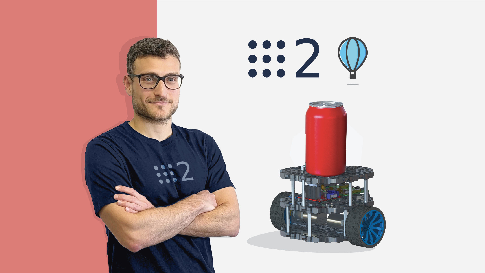
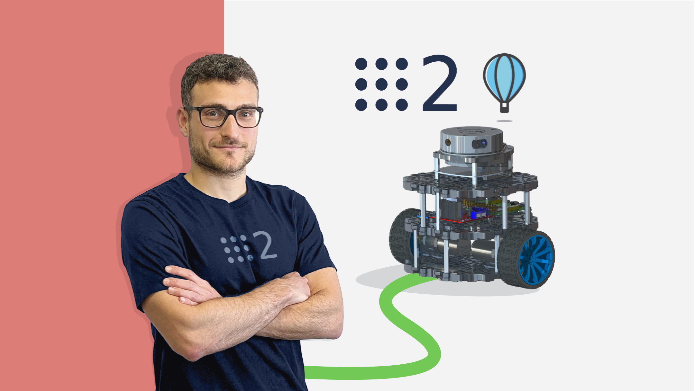
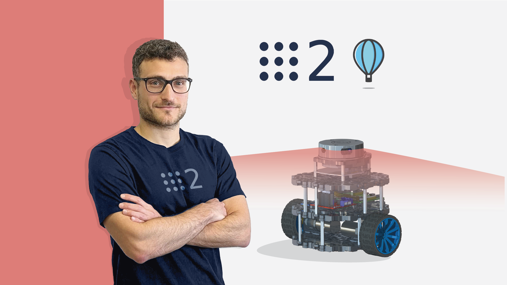

# Self-Driving and ROS 2 - Learn by Doing! Odometry & Control
[![LinkedIn][linkedin-shield]][linkedin-url]
[![Udemy][udemy-shield]][udemy-url]

<!-- PROJECT LOGO -->
<br />
<p align="center">
   
</p>

## Table of Contents

* [About the Course](#about-the-course)
* [Other Courses](#other-courses)
   * [Self Driving and ROS 2 - Learn by Doing! Plan & Navigation](#plan-navigation)
   * [Self Driving and ROS 2 - Learn by Doing! Map & Localization](#map-localization)
   * [Robotics and ROS 2 - Learn by Doing! Manipulators](#manipulators)
* [Getting Started](#getting-started)
  * [Prerequisites](#prerequisites)
* [Usage](#usage)
* [Contributing](#contributing)
* [License](#license)
* [Contact](#contact)
* [Acknowledgements](#acknowledgements)

<!-- ABOUT THE COURSE -->  
## About the Course
This repository contains the material used in the course **Self Driving and ROS 2 - Learn by Doing! Odometry & Control** that is currently available on the following platforms:
* [Udemy](https://www.udemy.com/course/self-driving-and-ros-2-learn-by-doing-odometry-control/?referralCode=50BCC4E84DB2DB09BFB3)

If you are passionate about Self-Driving and you want to make a real robot Autonomously Navigate, then this course is for you! 
Apart from explaining in detail all the functionalities and the logic of **ROS 2**, the latest version of the Robot Operating System, it covers some key concepts of Autonomous Navigation such as
* Sensor Fusion
* Kalman Filter
* Probability Theory
* Robot Kinematics
* Odometry
* Robot Localization
* Control

Furthermore, all the laboratory classes in which we are going to develop the actual Software of our mobile robot are available both in **Pyhton** and in **C++** to let you the freedom of choosing the programming language you like the most or become proficient in both!


<!-- OTHER COURSES -->
## Other Courses
### Self Driving and ROS 2 - Learn by Doing! Plan & Navigation
Have you ever developed a path-planning algorithm for your robot?
Do you want to know more about Motion Planning algorithms and how to use them to autonomously move your robot while avoiding obstacles using a Costmap of the environment?

Then this course will teach you exactly that, with many more topics:
* Path Planning
* Motion Planning
* Decision Making
* Behavior Trees
* Obstacle Avoidance
* Costmaps
* Nav2

Enroll on the following platforms:
<br />
<p align="center">
   
</p>

* [Udemy](https://www.udemy.com/course/self-driving-and-ros-2-learn-by-doing-plan-navigation/?referralCode=1F6AFF9E9A8E7D5D057A)


### Self Driving and ROS 2 - Learn by Doing! Map & Localization
Have you ever developed a mapping and a localization algorithm for your robot?
Do you want to know more about SLAM (Simultaneous Localization and Mapping) and how to use it to enable your robot to create a nice and accurate map of the environment using a 2D LiDAR sensor?

Then this course will teach you exactly that, with many more topics:
* Robot Localization
* Map Representations
* Mapping
* SLAM
* Obstacle Avoidance
* Speed and Separation monitoring
* Using LiDAR Sensors

enroll on the following platforms:
<br />
<p align="center">
   
</p>

* [Udemy](https://www.udemy.com/course/self-driving-and-ros-2-learn-by-doing-map-localization/?referralCode=8FC4AC725C57F7A93F79)


### Robotics and ROS 2 - Learn by Doing! Manipulators
If you find this course interesting and you are passionate about robotics in general (not limited to autonomous mobile robots), then you definitely have to take a look at my outher courses!
<br />
<p align="center">
   
</p>

In this course, I'll guide you through the creation of a real robotic arm that you can control with your voice using the Amazon Alexa voice assistant.
Some of the concepts that are covered in this course are

* Gazebo Simulation
* Robot Kinematics
* ROS 2 Basics
* MoveIt 2
* Using Arduino with ROS 2
* Interface Alexa with ROS 2

Looks funny? Check it out on the following platforms:
* [Udemy](https://www.udemy.com/course/robotics-and-ros-2-learn-by-doing-manipulators/?referralCode=4B27D2CF97C1E099DD4C)

#### ROS 1 Nostalgic?

Do you want to master Self-Driving or Manipulation using **ROS**, the first version of the Robot Operating System? 

Despite many companies already starting to switch to ROS 2, knowing both ROS 1 and ROS 2 will position you at the forefront of this demand, making you an attractive candidate for a wide range of roles.

Here you can access the same courses, where will be created the same robots, implementing the same functionalities in ROS 1

* [Self Driving and ROS - Learn by Doing! Odometry & Control](https://www.udemy.com/course/self-driving-and-ros-learn-by-doing-odometry-control/?referralCode=5B857932D7C6FE9D014D)

* [Robotics and ROS - Learn by Doing! Manipulators](https://www.udemy.com/course/robotics-and-ros-learn-by-doing-manipulators/?referralCode=6EDAA8501C5E3CCEE526)

<!-- GETTING STARTED -->
## Getting Started
You can decide whether to build the real robot or just have fun with the simulated one. The course can be followed either way, most of the lessons and most of the code will work the same in the simulation as in the real robot

### Prerequisites
You don't need any prior knowledge of ROS 2 nor of Self-Driving, I'll explain all the concepts as they came out and as they are needed to implement new functionalities to our robot.
A basic knowledge of programming, either using **C++** or **Python** is required as this is not a Programming course and so I'll not dwell too much on basic Programming concepts.

To prepare your PC you need:
* Install Ubuntu 22.04 on PC or in a Virtual Machine
Download the ISO [Ubuntu 22.04](https://ubuntu.com/download/) for your PC
* Install [ROS Humble](https://docs.ros.org/en/humble/Installation/Ubuntu-Install-Debians.html) or [ROS Iron](https://docs.ros.org/en/iron/Installation/Ubuntu-Install-Debians.html) on your Ubuntu 22.04
* Install ROS 2 missing libraries. Some libraries that are used in this project are not in the standard ROS 2 package. Install them with:
```sh
sudo apt-get update && sudo apt-get install -y \
     ros-humble-ros2-controllers \
     ros-humble-gazebo-ros \
     ros-humble-gazebo-ros-pkgs \
     ros-humble-ros2-control \
     ros-humble-gazebo-ros2-control \
     ros-humble-joint-state-publisher-gui \
     ros-humble-joy \
     ros-humble-joy-teleop \
     ros-humble-turtlesim \
     ros-humble-robot-localization \
     ros-humble-tf-transformations
```

<!-- USAGE -->
## Usage
To Launch the Simulation of the Robot 
1. Clone the repo
```sh
git clone https://github.com/AntoBrandi/Self-Driving-and-ROS-2-Learn-by-Doing-Odometry-Control.git
```
2. Build the ROS 2 workspace
```sh
cd ~/Self-Driving-and-ROS-2-Learn-by-Doing-Odometry-Control/Section11_Sensor-Fusion/bumperbot_ws
```
```sh
colcon build
```
3. Source the ROS 2 Workspace
```sh
. install/setup.bash
```
4. Launch the Gazebo simulation
```sh
ros2 launch bumperbot_description gazebo.launch.py
```

<!-- CONTRIBUTING -->
## Contributing
Contributions are what make the open source community such an amazing place to learn, inspire, and create. Any contributions you make are **greatly appreciated**.

1. Fork the Project
2. Create your Feature Branch (`git checkout -b feature/AmazingFeature`)
3. Commit your Changes (`git commit -m 'Add some AmazingFeature'`)
4. Push to the Branch (`git push origin feature/AmazingFeature`)
5. Open a Pull Request


<!-- LICENSE -->
## License

Distributed under the Apache 2.0 License. See `LICENSE` for more information.


<!-- CONTACT -->
## Contact

Antonio Brandi - [LinkedIn]([linkedin-url]) - antonio.brandi@outlook.it

My Projects: [https://github.com/AntoBrandi](https://github.com/AntoBrandi)


<!-- ACKNOWLEDGEMENTS -->
## Acknowledgements
* [Course Cover Images](https://www.linkedin.com/in/delia-garc%C3%ADa-masegosa-109bb040/)
* [Turtlebot 3 Software](https://github.com/ROBOTIS-GIT/turtlebot3)
* [Turtlebot 3 Hardware](https://cad.onshape.com/documents/2586c4659ef3e7078e91168b/w/14abf4cb615429a14a2732cc/e/9ae9841864e78c02c4966c5e)


<!-- MARKDOWN LINKS & IMAGES -->
[linkedin-shield]: https://img.shields.io/badge/-LinkedIn-black.svg?style=flat-square&logo=linkedin&colorB=555
[linkedin-url]: https://www.linkedin.com/in/antonio-brandi-512166bb/
[udemy-shield]: https://img.shields.io/badge/-Udemy-black.svg?style=flat-square&logo=udemy&colorB=555
[udemy-url]: https://www.udemy.com/course/self-driving-and-ros-2-learn-by-doing-odometry-control/?referralCode=50BCC4E84DB2DB09BFB3
